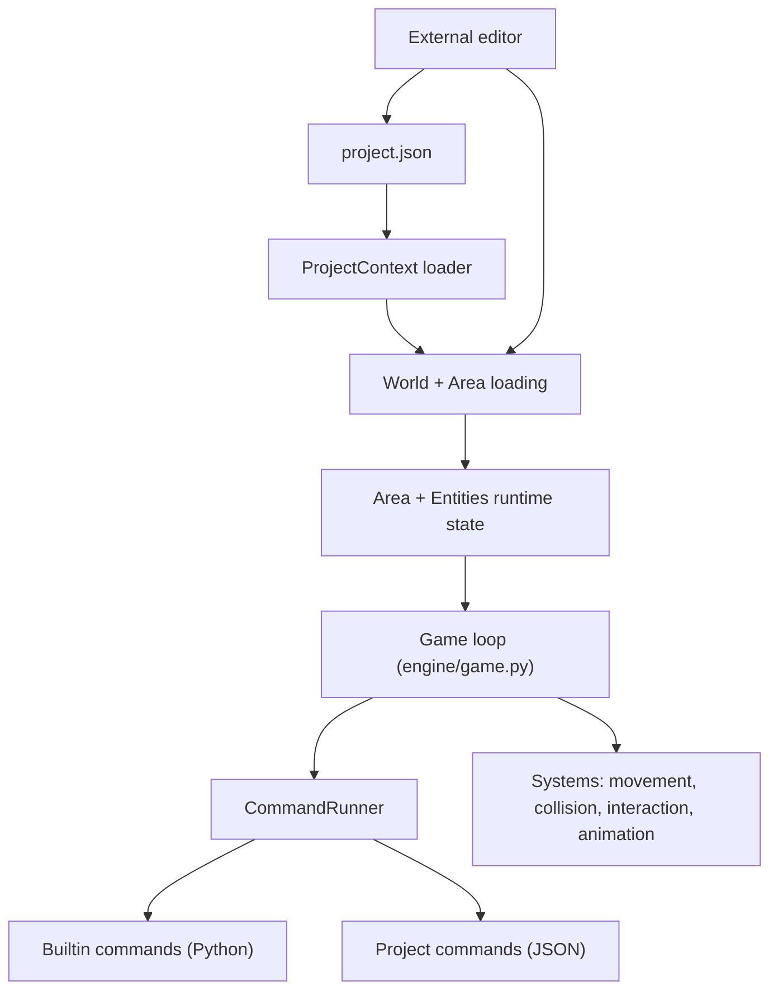

# Engine In 10 Minutes

This is the shortest practical map of how the engine fits together. It is not a full spec. It is meant to make the codebase feel navigable fast.

## What This Engine Is

The runtime is a command-driven 2D puzzle/RPG engine. Game behavior lives in JSON command chains and authored data. The Python code provides runtime systems and the command runner.

If you only remember one sentence: the engine runs commands, the project authors behavior.

## The Runtime In One Picture

## The 3 Key Surfaces

1. **Project content**: `project.json`, areas, entity templates, commands, items, dialogue data. See `docs/authoring/manuals/authoring-guide.md`.
2. **Command runner**: resolves JSON commands and drives runtime behavior. `CommandContext` carries runner/project state, while `CommandServices` is the source of truth for injected runtime dependencies like `world`, `camera`, dialogue/inventory runtimes, persistence, and scene-change hooks. See `dungeon_engine/commands/runner.py`.
3. **Runtime systems**: movement, collision, interaction, animation, rendering, persistence. See `dungeon_engine/systems/` and `dungeon_engine/engine/`.

## Authoring Flow (Mental Model)

1. `project.json` declares where to find project content.
2. Areas define tiles, entities, and enter hooks.
3. Entity templates define reusable behavior and data.
4. Command chains orchestrate gameplay through engine primitives.
5. Dialogue and menu data are ordinary JSON files.

Ids are path-derived. Do not author `id` fields inside area or command files. Use paths like `areas/start` and `commands/dialogue/open`.

## Runtime Loop Essentials

The play loop is explicit about phases. The default flow is:

1. Settle ready commands and modal runtimes at zero-dt.
2. Advance simulation systems (movement).
3. Advance runtime waits (commands, dialogue, inventory).
4. Settle again.
5. Process input intent into commands.
6. Settle again.
7. Advance presentation (animation, screen UI, camera).
8. Apply scene-boundary changes.

That flow lives in `dungeon_engine/engine/game.py`.

## Where To Start For Common Changes

- New built-in command: `dungeon_engine/commands/builtin.py` and `dungeon_engine/commands/builtin_domains/`.
- Command resolution rules: `dungeon_engine/commands/runner_resolution.py`.
- Area/entity loading: `dungeon_engine/world/loader.py` and `dungeon_engine/world/loader_entities.py`.
- Persistence logic: `dungeon_engine/world/persistence.py` and related helpers.
- External editor behavior: `tools/area_editor/`.

## Editor Boundary

The editor is external on purpose. It reads and writes the same JSON that the runtime consumes. The editor should not be imported by the runtime, and the runtime should not assume the editor is present.

## If You Have 30 Minutes

Open a repo-local project, then trace one area and one entity template:

1. `projects/<project>/project.json`
2. One area in `areas/`
3. One template in `entity_templates/`
4. One command chain in `commands/`

Then run the editor on that same project to see how it edits the data you just read.
